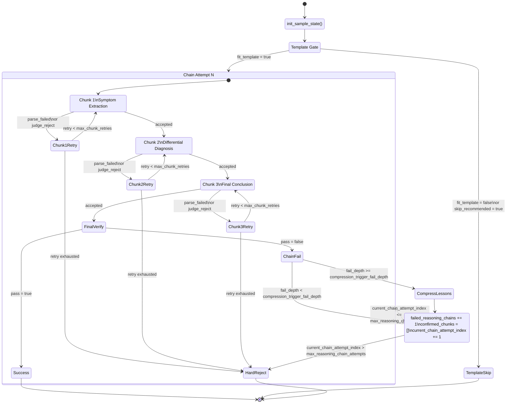

# 加速版 PRM CoT 数据合成说明

本文档对应当前主流程 `[search_for_complex_reasoning_path.py](/home/fxs/LLM1.30/HuatuoGPT-o1/search_for_complex_reasoning_path.py)` 和核心实现 `[cot_pipeline_accelerated.py](/home/fxs/LLM1.30/HuatuoGPT-o1/cot_pipeline_accelerated.py)`。

这版实现的目标不是“一次性产出完整 SFT 样本”，而是先高效地产出 `verified Long_CoT`，把最贵的 `Complex_CoT` 改写和最终 `Response` 生成拆到独立后处理脚本 `[postprocess_verified_long_cot.py](/home/fxs/LLM1.30/HuatuoGPT-o1/postprocess_verified_long_cot.py)`。

## 1. 架构变化

旧版主流程的问题是：

- 生成、验证、改写、最终回答全部串在一次在线调用里。
- 中间步骤与后处理耦合，失败一条链就要把所有昂贵步骤都重跑。
- 小模型 Judge 走远程 API，请求多、延迟高、费用也累积。

当前版本改成两段式：

1. 主流程只做 `verified Long_CoT`
2. 后处理流程再按需生成 `Complex_CoT` 和 `Response`

收益是：

- 主流程更短，失败重试更便宜。
- 验证结果可直接沉淀复用，不必每次重写自然 CoT。
- `generator` 可以走在线并发或 Batch API，`judge` 可以本地化运行。

## 2. 主流程状态机

主状态机入口在：

- `[cot_pipeline_accelerated.py](/home/fxs/LLM1.30/HuatuoGPT-o1/cot_pipeline_accelerated.py#L2232)` `run_verified_long_cot_pipeline(...)`
- `[cot_pipeline_accelerated.py](/home/fxs/LLM1.30/HuatuoGPT-o1/cot_pipeline_accelerated.py#L1997)` `run_chunk_stage(...)`
- `[cot_pipeline_accelerated.py](/home/fxs/LLM1.30/HuatuoGPT-o1/cot_pipeline_accelerated.py#L2091)` `verify_final_chain(...)`
- `[cot_pipeline_accelerated.py](/home/fxs/LLM1.30/HuatuoGPT-o1/cot_pipeline_accelerated.py#L2149)` `verify_final_chains_local_batch(...)`

下面是每条样本的状态机流程图：



关键状态变量：

- `sample_status`：`running` / `success` / `template_skip` / `hard_reject` / `error`
- `_runtime["confirmed_chunks"]`：当前已经通过 Judge 的 Chunk 历史
- `_runtime["failed_reasoning_chains"]`：整条链终审失败后的历史记录
- `_runtime["reasoning_lesson_summary"]`：失败链压缩后的经验总结
- `_runtime["current_chain_attempt_index"]`：当前是第几轮整链尝试

状态跳转规则：

- Chunk 内部失败不会直接触发总结，只会在当前 Chunk 内重试，超过上限后 `hard_reject`
- 只有 `Chunk 1/2/3` 都通过后，才会进入 `final-chain verify`
- 只有整条链 `final-chain verify` 失败后，才会把整链放入 `failed_reasoning_chains`
- 达到 `compression_trigger_fail_depth` 后，才会调用 `summarize_lessons()` 压缩上下文
- 压缩完成后从 `Chunk 1` 重新开始下一轮 `chain attempt`

注意：上下文压缩发生在“整条 reasoning chain 终审失败之后”，不是某个单独 Chunk 被拒时立刻压缩。

## 3. Chunk 规则

固定三段：

- `Chunk 1`：`Symptom Extraction & Pathology Mapping`
- `Chunk 2`：`Differential Diagnosis & Elimination`
- `Chunk 3`：`Final Conclusion`

每个 Chunk 都要求输出 JSON。启用 `--use_json_mode` 时，会显式向生成模型请求 JSON object，减少 parse failed。

兼容性说明：

- 硅基流动上的部分模型并不支持 JSON mode。
- 当前代码对 `Qwen/QwQ-32B` 已做自动回退：若接口返回 “Json mode is not supported for this model”，客户端会自动去掉 `response_format` 并重试。

## 4. Judge 逻辑

Judge 默认支持两种后端：

- `--judge_backend local`
- `--judge_backend remote`

当前推荐使用本地 Judge，模型路径默认是：

`models/Qwen2.5-7B-Instruct`

如果要启用本地批量 judge，可以额外设置：

`--local_judge_batch_size 8`

关键规则：

- `Chunk 1` 和 `Chunk 2` 不向 Judge 注入 `reference_answer`
- Judge 只能判断：
  - 是否符合当前 Chunk 目标
  - 是否符合医学常识
  - 是否有幻觉、跳步、越界
- `Chunk 3` 才引入 `reference_answer`
- 同一个候选 Chunk 最多审核 `max_chunk_judge_attempts` 次，默认 `3`
- 3 次都拒绝则直接 `hard_reject`

这避免了中间 Chunk 因为“没有提前写最终答案”而被错杀。

## 5. 上下文压缩

当某条样本连续出现多次“整链终审失败”后，`compression_trigger_fail_depth` 会触发 `summarize_lessons()`：

- 提炼当前已确认线索
- 汇总前几轮整链推理里的高频错误
- 给出下一轮从 `Chunk 1` 重启时的注意点

压缩后，生成模型不再看到完整失败链，只看到一份更短的 lessons summary，减少长上下文确认偏误和 token 浪费。

## 6. 主流程输出

主流程成功样本只保证这些字段：

- `Long_CoT`
- `chunk_trace`
- `reasoning_chain_attempts`
- `judge_trace`
- `lesson_summaries`
- `Final_Answer`
- `verified_long_cot_ready=true`

主流程不再默认生成：

- `Complex_CoT`
- `Response`

## 7. 后处理脚本

后处理脚本：

`[postprocess_verified_long_cot.py](/home/fxs/LLM1.30/HuatuoGPT-o1/postprocess_verified_long_cot.py)`

职责是：

1. 把 `Long_CoT` 改写成自然语言 `Complex_CoT`
2. 基于 `Complex_CoT` 生成最终 `Response`

支持：

- `--backend online`
- `--backend batch`

因此可以把最耗时但对验证不关键的改写任务挪到更便宜的 Batch API 上。

## 8. 推荐命令

### 主流程：在线生成 + 本地 Judge

```bash
./.venv312/bin/python search_for_complex_reasoning_path.py \
  --data_path data/medical_o1_verifiable_problem_30.json \
  --api_key "$SILICONFLOW_API_KEY" \
  --generator_model_name Qwen/QwQ-32B \
  --summary_model_name Qwen/QwQ-32B \
  --judge_backend local \
  --local_judge_model_path models/Qwen2.5-7B-Instruct \
  --generator_backend online \
  --num_process 16 \
  --max_reasoning_chain_attempts 3 \
  --max_chunk_retries 3 \
  --max_chunk_judge_attempts 3 \
  --compression_trigger_fail_depth 2 \
  --use_json_mode \
  --mode_suffix verified_LongCoT_stage_localjudge
```

### 主流程：Batch 生成 + 本地 Judge

```bash
./.venv312/bin/python search_for_complex_reasoning_path.py \
  --data_path data/medical_o1_verifiable_problem_2000.json \
  --api_key "$SILICONFLOW_API_KEY" \
  --generator_model_name Qwen/QwQ-32B \
  --summary_model_name Qwen/QwQ-32B \
  --judge_backend local \
  --local_judge_model_path models/Qwen2.5-7B-Instruct \
  --generator_backend batch \
  --batch_completion_window 24h \
  --batch_poll_interval 60 \
  --use_json_mode
```

### 后处理：只做 Complex_CoT 和 Response

```bash
./.venv312/bin/python postprocess_verified_long_cot.py \
  --input_path medical_o1_verifiable_problem_30_verified_LongCoT_stage_localjudge_*.json \
  --api_key "$SILICONFLOW_API_KEY" \
  --generator_model_name Qwen/QwQ-32B \
  --response_model_name Qwen/QwQ-32B \
  --backend online
```

## 9. 输出位置

主流程单样本落盘目录：

`output_data/<task_name>/<process_id>.json`

主流程聚合成功样本：

`<task_name>_<success_count>.json`

后处理默认输出：

`<input_path_without_suffix>_postprocessed.json`

## 10. 适用建议

- 要尽快拿到高质量可验证链，先只跑主流程。
- 要控费，优先让主流程产出 `verified Long_CoT`，把 `Complex_CoT`/`Response` 留到后面。
- 要跑大规模 4 万条，优先考虑：
  - 主流程 generator 走 Batch API
  - Judge 本地化
  - 多机分片输入数据
  - 后处理单独批量跑
